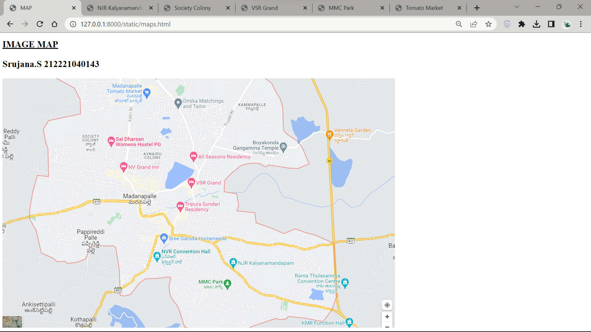
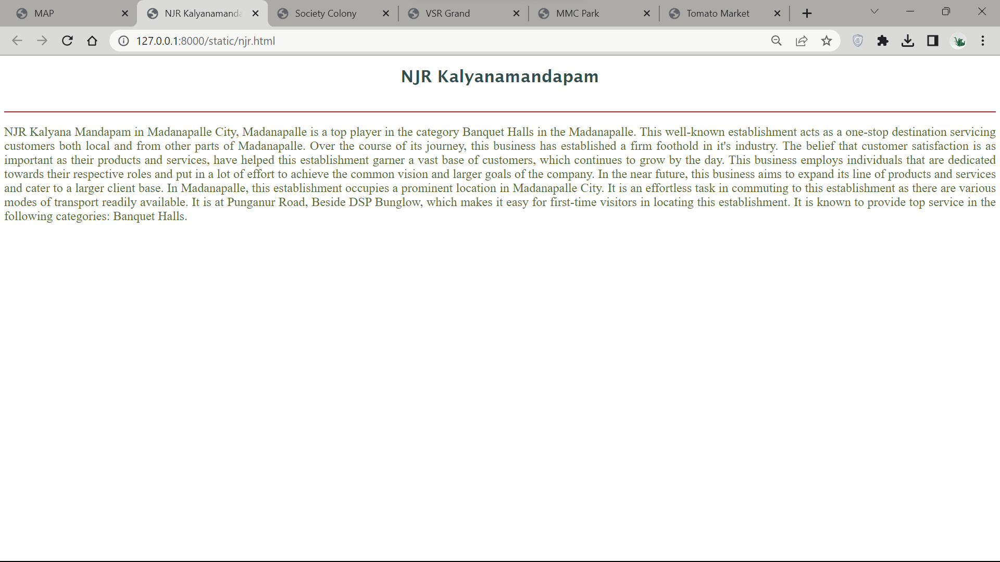
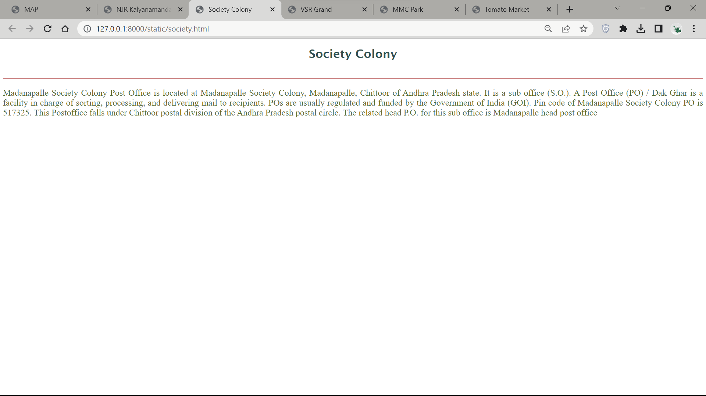
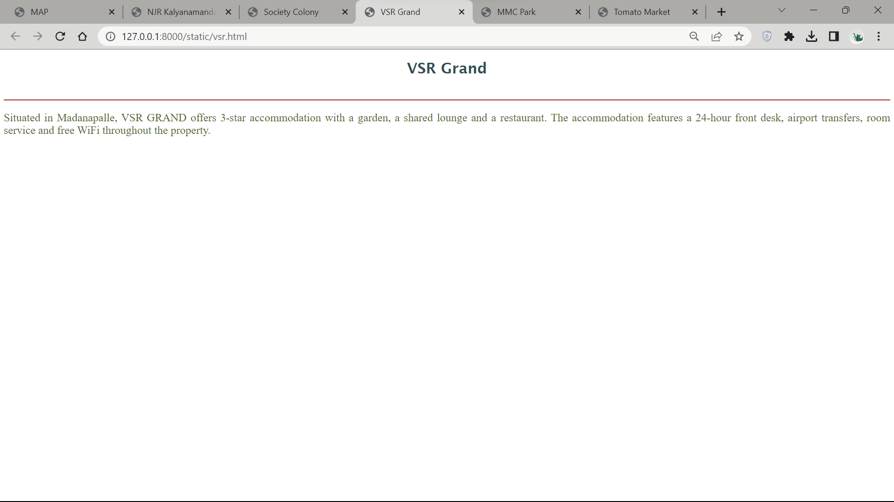
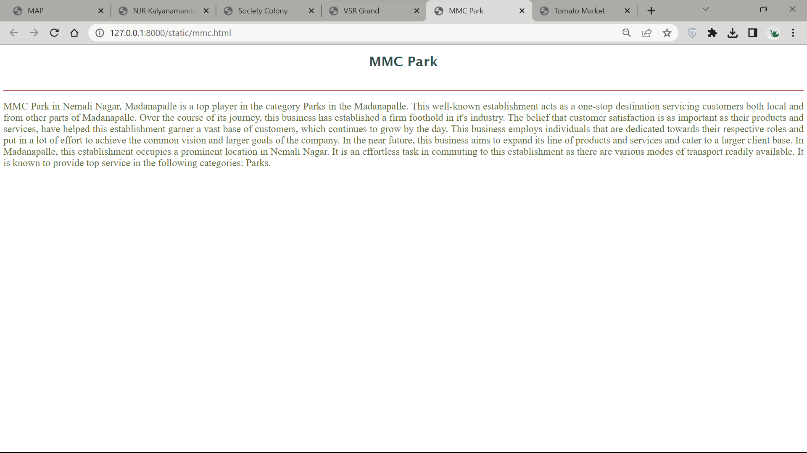
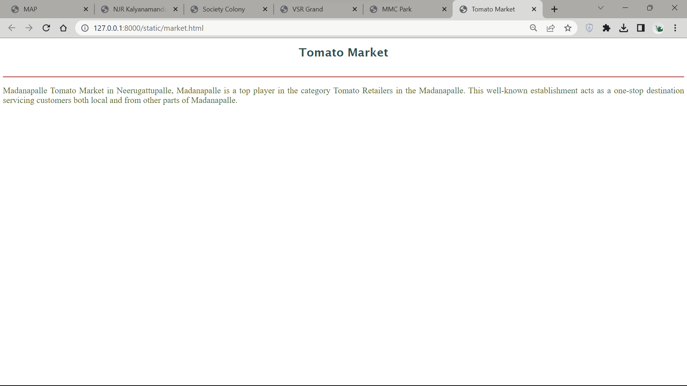
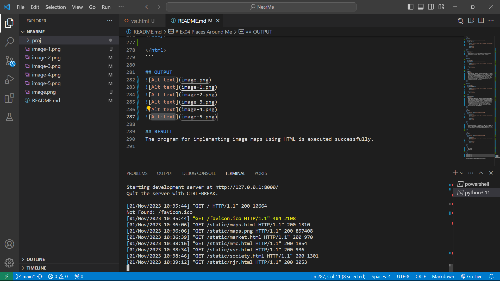

# Ex04 Places Around Me

Date : 17-10-2023

## AIM
To develop a website to display details about the places around my house.

## DESIGN STEPS

### STEP 1
Create a Django admin interface.

### STEP 2
Download your city map from Google.

### STEP 3
Using ```<map>``` tag name the map.

### STEP 4
Create clickable regions in the image using ```<area>``` tag.

### STEP 5
Write HTML programs for all the regions identified.

### STEP 6
Execute the programs and publish them.

## CODE

```html
<!DOCTYPE html>
<html>

<head>
    <meta charset="utf-8" />
    <meta name="viewport" content="width=device-width, initial-scale=1.0" />
    <title>MAP</title>
</head>

<body>
    <centre>
        <h1 align:"center" style="font-size: 30px;">
            <u>IMAGE MAP</u>
            <p>Srujana.S 212221040143</p>
        </h1>
        
        <map name="image-map">
            <area target="_blank" alt="VSR Grand" title="VSR Grand" href="vsr.html"
                coords="639,357,600,353,596,371,628,371,11,780" shape="poly">
            <area target="_blank" alt="MMC Park" title="MMC Park" href="mmc.html" coords="720,680,747,682,740,698,722,694"
                shape="poly">
            <area target="_blank" alt="Society Colony" title="Society Colony" href="njr.html"
                coords="271,213,301,211,301,239,274,239" shape="poly">
            <area target="_blank" alt="NJR Kalyanamandapam" title="NJR Kalyanamandapam" href="society.html"
                coords="740,612,763,612,761,631,740,623" shape="poly">
            <area target="_blank" alt="Tomato Market" title="Tomato Market" href="market.html" coords="459,63,475,63,475,75,457,80"
                shape="poly">
        </map>
    </centre>
</body>

</html>
```

```html
<!DOCTYPE html>
<html lang="en">

<head>
    <meta charset="UTF-8">
    <meta name="viewport" content="width=device-width, initial-scale=1.0">
    <title>Tomato Market</title>
    <style>
        h1 {
            text-align: center;
            font-family: 'Lucida Sans', 'Lucida Sans Regular', 'Lucida Grande', 'Lucida Sans Unicode', Geneva, Verdana, sans-serif;
            color: darkslategray;
        }

        p {
            text-align: justify;
            color: darkolivegreen;
            font-size: x-large;

        }
    </style>
</head>

<body>
    <h1>Tomato Market</h1>
    <br>
    <hr color="Brown">
    <p>
        Madanapalle Tomato Market in Neerugattupalle, Madanapalle is a top player in the category 
        Tomato Retailers in the Madanapalle. This well-known establishment acts as a one-stop 
        destination servicing customers both local and from other parts of Madanapalle.
    </p>
</body>

</html>
```

```html
<!DOCTYPE html>
<html lang="en">

<head>
    <meta charset="UTF-8">
    <meta name="viewport" content="width=device-width, initial-scale=1.0">
    <title>MMC Park</title>
    <style>
        h1 {
            text-align: center;
            font-family: 'Lucida Sans', 'Lucida Sans Regular', 'Lucida Grande', 'Lucida Sans Unicode', Geneva, Verdana, sans-serif;
            color: darkslategray;
        }

        p {
            text-align: justify;
            color: darkolivegreen;
            font-size: x-large;

        }
    </style>
</head>

<body>
    <h1>MMC Park</h1>
    <br>
    <hr color="Brown">
    <p>
        MMC Park in Nemali Nagar, Madanapalle is a top player in the category Parks in the Madanapalle.
        This well-known establishment acts as a one-stop destination servicing customers both local and
        from other parts of Madanapalle. Over the course of its journey, this business has established a
        firm foothold in it's industry. The belief that customer satisfaction is as important as their
        products and services, have helped this establishment garner a vast base of customers, which
        continues to grow by the day. This business employs individuals that are dedicated towards
        their respective roles and put in a lot of effort to achieve the common vision and larger
        goals of the company. In the near future, this business aims to expand its line of products
        and services and cater to a larger client base. In Madanapalle, this establishment occupies
        a prominent location in Nemali Nagar. It is an effortless task in commuting to this
        establishment as there are various modes of transport readily available. It is known to
        provide top service in the following categories: Parks.
    </p>
</body>

</html>
```

```html
<!DOCTYPE html>
<html lang="en">

<head>
    <meta charset="UTF-8">
    <meta name="viewport" content="width=device-width, initial-scale=1.0">
    <title>NJR Kalyanamandapam</title>
    <style>
        h1 {
            text-align: center;
            font-family: 'Lucida Sans', 'Lucida Sans Regular', 'Lucida Grande', 'Lucida Sans Unicode', Geneva, Verdana, sans-serif;
            color: darkslategray;
        }

        p {
            text-align: justify;
            color: darkolivegreen;
            font-size: x-large;

        }
    </style>
</head>

<body>
    <h1>NJR Kalyanamandapam</h1>
    <br>
    <hr color="Brown">
    <p>
        NJR Kalyana Mandapam in Madanapalle City, Madanapalle is a top player in the category Banquet
        Halls in the Madanapalle. This well-known establishment acts as a one-stop destination servicing
        customers both local and from other parts of Madanapalle. Over the course of its journey, this
        business has established a firm foothold in it's industry. The belief that customer
        satisfaction is as important as their products and services, have helped this establishment
        garner a vast base of customers, which continues to grow by the day. This business employs
        individuals that are dedicated towards their respective roles and put in a lot of effort to
        achieve the common vision and larger goals of the company. In the near future, this business
        aims to expand its line of products and services and cater to a larger client base.
        In Madanapalle, this establishment occupies a prominent location in Madanapalle City.
        It is an effortless task in commuting to this establishment as there are various modes
        of transport readily available. It is at Punganur Road, Beside DSP Bunglow, which makes
        it easy for first-time visitors in locating this establishment. It is known to provide
        top service in the following categories: Banquet Halls.
    </p>
</body>

</html>

```

```html
<!DOCTYPE html>
<html lang="en">

<head>
    <meta charset="UTF-8">
    <meta name="viewport" content="width=device-width, initial-scale=1.0">
    <title>Society Colony</title>
    <style>
        h1 {
            text-align: center;
            font-family: 'Lucida Sans', 'Lucida Sans Regular', 'Lucida Grande', 'Lucida Sans Unicode', Geneva, Verdana, sans-serif;
            color: darkslategray;
        }

        p {
            text-align: justify;
            color: darkolivegreen;
            font-size: x-large;

        }
    </style>
</head>

<body>
    <h1>Society Colony</h1>
    <br>
    <hr color="Brown">
    <p>
        Madanapalle Society Colony Post Office is located at Madanapalle Society Colony, Madanapalle,
        Chittoor of Andhra Pradesh state. It is a sub office (S.O.). A Post Office (PO) / Dak Ghar is a
        facility in charge of sorting, processing, and delivering mail to recipients. POs are usually
        regulated and funded by the Government of India (GOI). Pin code of Madanapalle Society Colony
        PO is 517325. This Postoffice falls under Chittoor postal division of the Andhra Pradesh postal
        circle. The related head P.O. for this sub office is Madanapalle head post office


    </p>
</body>

</html>
```

```html
<!DOCTYPE html>
<html lang="en">

<head>
    <meta charset="UTF-8">
    <meta name="viewport" content="width=device-width, initial-scale=1.0">
    <title>VSR Grand</title>
    <style>
        h1 {
            text-align: center;
            font-family: 'Lucida Sans', 'Lucida Sans Regular', 'Lucida Grande', 'Lucida Sans Unicode', Geneva, Verdana, sans-serif;
            color: darkslategray;
        }

        p {
            text-align: justify;
            color: darkolivegreen;
            font-size: x-large;

        }
    </style>
</head>

<body>
    <h1>VSR Grand</h1>
    <br>
    <hr color="Brown">
    <p>
        Situated in Madanapalle, VSR GRAND offers 3-star accommodation with a garden, a shared lounge and a restaurant.
        The accommodation features a 24-hour front desk, airport transfers, room service and free WiFi throughout the
        property.
    </p>
</body>

</html>
```

## OUTPUT








## RESULT
The program for implementing image maps using HTML is executed successfully.
